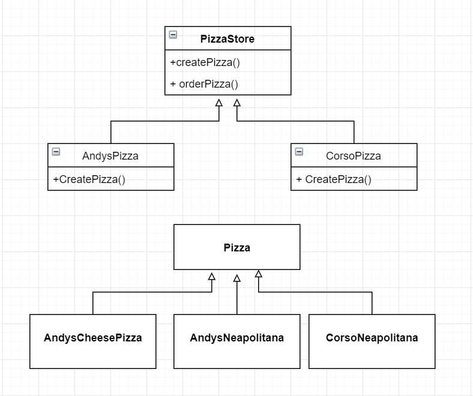
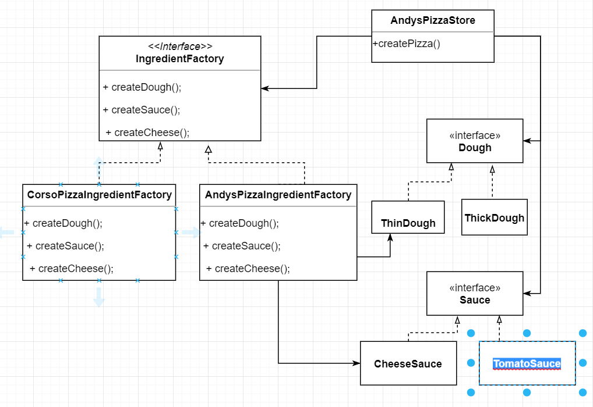
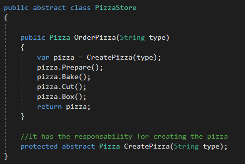
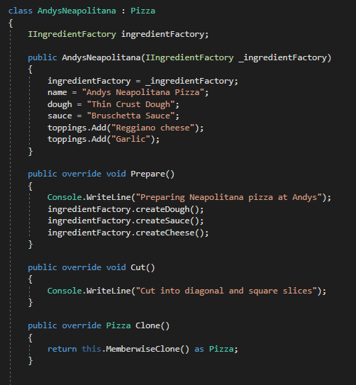
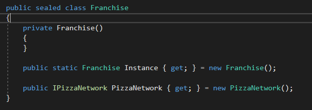
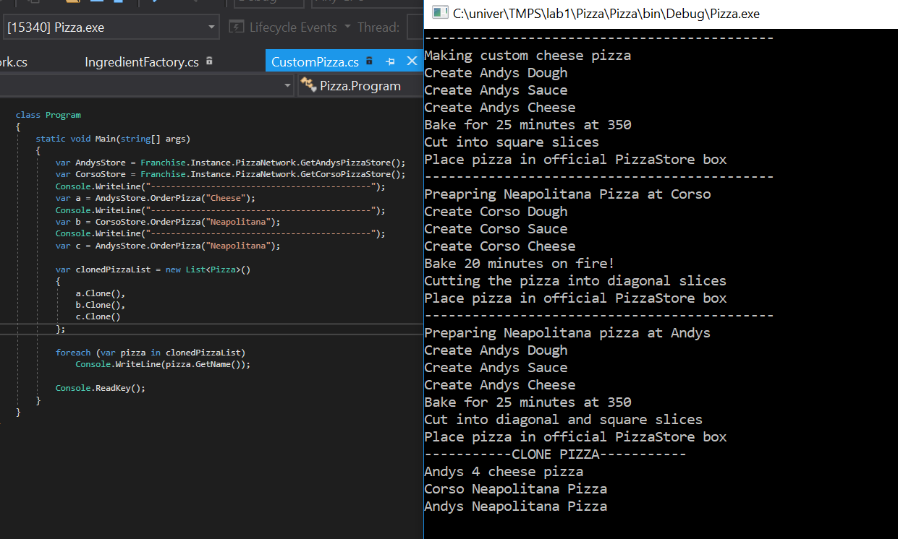

# Лабораторная работа №1
_Подготовила студентка группы TI-164, Рябинина Алиса_
## Задание 
Целью данной лабораторной работы было имплементировать 5 порождающих паттернов
## Использованные порождающие паттерны
1. _Abstract Factory_
2. _Factory Method_
3. _Singleton_
4. _Prototype_
5. _Builder_

## _Abstract Factory_
Абстрактная фабрика — это порождающий паттерн проектирования, который позволяет создавать семейства связанных объектов, не привязываясь к конкретным классам создаваемых объектов.

## _Factory Method_
Фабричный метод — это порождающий паттерн проектирования, который определяет общий интерфейс для создания объектов в суперклассе, позволяя подклассам изменять тип создаваемых объектов.

## _Singleton_
Singleton — это порождающий паттерн проектирования, который гарантирует, что у класса есть только один экземпляр, и предоставляет к нему глобальную точку доступа.

## _Prototype_
Prototype - это порождающий паттерн проектирования, который позволяет копировать объекты, не вдаваясь в подробности их реализации.

## _Builder_
Builder - это порождающий паттерн проектирования, который позволяет создавать сложные объекты пошагово. Строитель даёт возможность использовать один и тот же код строительства для получения разных представлений объектов.

## Реализация
В моём приложении реализовано несколько классов:
1. _Franchise_  - использует Singleton и представляет экземпляр класса pizzaNetwork 
2. _PizzaNetwork_ - создаёт Andy's Pizza и Corso pizza 
3. _PizzaStore_ and _Pizza_ - используют Factory Method Pattern
4. _Pizza_ создаются при помощи Builder Design Pattern
5. _IngredientsFactory_ использует Abstract Factory  

Для того, чтобы показать как это работает, было создано несколько диаграмм. Вот к примеру, 
Factory Design Pattern: 

Для того, чтобы комбинировать abstract factory и abstract factory method, factory method был использован для того, чтобы имплиментировать методы в abstract factory (CreateDough(), CreateCheese();...)

Пицца создаётся используя Builder Pattern:  

Так же мы можем клонировать пиццу используя паттерн Prototype:

Franchise использует Singleton, и предоставляет нам экземпляр класса pizzaNetwork, который мы используем для создания pizzaStore

Результат работы программы: 

# Вывод
В ходе данной лабораторной работы мы изучили и реализовали порождающие паттерны, они нам упрощают и структурируют код

